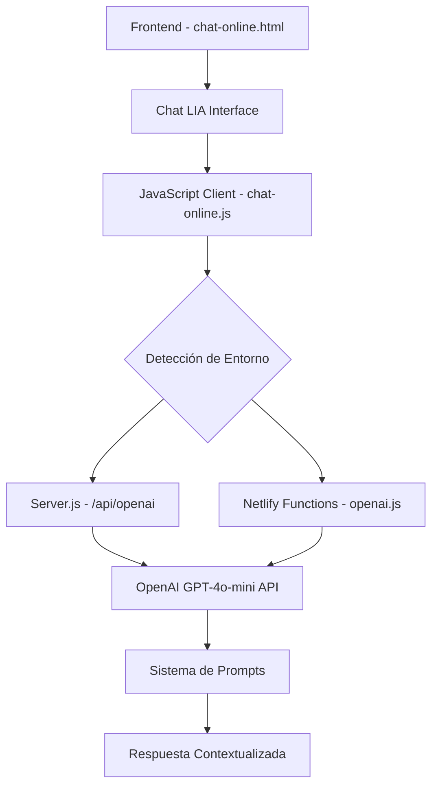

# Documentación Backend - Chat LIA (Learning Intelligence Assistant)

## 📋 Resumen Ejecutivo

El chat LIA es un asistente de inteligencia artificial integrado en la plataforma educativa que proporciona respuestas contextualizadas sobre el curso "Experto en IA para Profesionales". El sistema utiliza OpenAI GPT-4o-mini como motor de IA y está integrado directamente en el panel derecho de la interfaz `chat-online.html`.

## 🏗️ Arquitectura del Sistema

### Componentes Principales



## 🎯 Ubicación del Chat LIA

### Panel Derecho (Right Panel)
**Archivo:** `src/Chat-Online/chat-online.html` (líneas 2540-2670)

```html
<!-- Panel Derecho - LIA Assistant y Notas -->
<aside class="right-panel" id="sidebarRight">
    <!-- LIA Assistant -->
    <div class="lia-assistant-section">
        <div class="lia-header">
            <h3>
                <div class="lia-avatar">
                    
                </div>
                LIA
            </h3>
        </div>
        <!-- Chat de LIA -->
        <div class="lia-chat">
            <div class="lia-messages" id="liaMessages">
                <!-- Mensajes del chat -->
            </div>
        </div>
        <!-- Input de LIA -->
        <div class="lia-input">
            <input type="text" id="liaMessageInput" placeholder="Pregunta a LIA...">
            <button class="action-btn" id="sendLiaMessage">
                <!-- Botón de envío -->
            </button>
        </div>
    </div>
</aside>
```

## 🔧 Backend APIs

### 1. Endpoint Local - Server.js
**Ruta:** `/api/openai`  
**Archivo:** `server.js` (líneas 3482-3600)

#### Características:
- **Puerto:** 3000 (desarrollo local)
- **Autenticación:** JWT Token validation
- **Método:** POST
- **Rate Limiting:** Implementado
- **CORS:** Configurado para desarrollo

#### Request Body:
```json
{
    "prompt": "Pregunta del usuario",
    "context": "Contexto adicional del curso"
}
```

#### Headers Requeridos:
```javascript
{
    "Authorization": "Bearer <jwt_token>",
    "Content-Type": "application/json",
    "x-user-id": "<user_id>"
}
```

### 2. Endpoint Netlify Functions
**Ruta:** `/.netlify/functions/openai`  
**Archivo:** `netlify/functions/openai.js`

#### Características:
- **Entorno:** Netlify Dev (puerto 8888) y Producción
- **Autenticación:** JWT Token validation con fallback de desarrollo
- **CORS:** Manejado por `cors-utils.js`

## 🧠 Sistema de Contexto

### Función Principal: `obtenerContextoCurso()`
**Estado:** ❌ **NO IMPLEMENTADA COMPLETAMENTE**

#### Implementación Actual:
```javascript
// En chat-online.js línea 849
const context = typeof obtenerContextoCurso === 'function' ? 
    obtenerContextoCurso() : this.obtenerContextoFallback();
```

#### Contexto de Fallback:
```javascript
obtenerContextoFallback() {
    return `
        Taller: Taller de fundamentos de Inteligencia Artificial con tutor personalizado
        Módulo: Fundamentos de IA
        Contenido: Introducción a conceptos básicos de inteligencia artificial, 
                  machine learning y aplicaciones prácticas
    `;
}
```

### ⚠️ **PROBLEMA IDENTIFICADO**

**El sistema actualmente NO obtiene contexto específico del video actual.** La función `obtenerContextoCurso()` no está definida en el HTML embebido, por lo que siempre usa el contexto de fallback genérico.

## 🎬 Información de Videos Disponible

### Estructura de Videos (Módulos):
```javascript
// Datos hardcodeados en chat-online.js
modules: [
    {
        module_number: 1,
        module_name: '¿Qué es la IA?',
        video_id: 'Yy_eZ65jzmo',
        status: 'in_progress'
    },
    {
        module_number: 2,
        module_name: 'Historia de la IA',
        video_id: 'dhsy6epaJGs',
        status: 'locked'
    },
    // ... más módulos
]
```

### Transcripciones Disponibles:
**Ubicación:** Contenido HTML estático en `chat-online.html`

```html
<!-- Contenido de Transcripción -->
<div class="transcript-content" data-content="transcript">
    <h4>Transcripción del Video - Módulo 1: ¿Qué es la IA?</h4>
    <p>En este módulo vamos a explorar los conceptos fundamentales...</p>
    <!-- Transcripción completa del video -->
</div>
```

## 🤖 Sistema de Prompts

### Prompts Principales:
1. **`system.es.md`** - Personalidad y comportamiento base de LIA
2. **`course-specific.es.md`** - Información específica del curso
3. **`style.es.md`** - Estilo de comunicación
4. **`safety.es.md`** - Restricciones de seguridad
5. **`tools.es.md`** - Herramientas disponibles
6. **`use_cases.es.md`** - Casos de uso
7. **`examples.es.md`** - Ejemplos de respuestas

### Estructura del Prompt Final:
```javascript
const messages = [
    { 
        role: 'system', 
        content: systemContent // Combinación de todos los prompts
    },
    { 
        role: 'system', 
        content: `Ejemplos de estilo: ${examples}` 
    },
    { 
        role: 'user', 
        content: `Usuario: ${mensaje}\n\nContexto: ${context}` 
    }
];
```

## 📡 Flujo de Comunicación

### 1. Usuario Envía Mensaje
```javascript
// Event listener en chat-online.html línea 3359
document.getElementById('sendLiaMessage').addEventListener('click', async () => {
    const mensaje = messageInput.value.trim();
    // Procesar mensaje...
});
```

### 2. Detección de Entorno y URL
```javascript
const isLocalhost = window.location.hostname === 'localhost';
const currentPort = window.location.port;

if (isLocalhost && currentPort === '3000') {
    apiUrl = '/api/openai';  // Server.js
} else if (isLocalhost && currentPort === '8888') {
    apiUrl = '/.netlify/functions/openai';  // Netlify Dev
} else {
    apiUrl = '/api/openai';  // Producción
}
```

### 3. Preparación del Contexto
```javascript
const currentUser = obtenerUsuarioActual();
const context = obtenerContextoCurso(); // ❌ NO IMPLEMENTADA
const prompt = `Usuario: ${mensaje}\n\nContexto: ${context}`;
```

### 4. Llamada a la API
```javascript
const response = await fetch(apiUrl, {
    method: 'POST',
    headers: {
        'Content-Type': 'application/json',
        'Authorization': `Bearer ${obtenerTokenAuth()}`,
        'x-user-id': currentUser?.id || 'chat-online-user'
    },
    body: JSON.stringify({
        prompt: prompt,
        context: `Información del usuario: ${JSON.stringify(currentUser || {})}`
    })
});
```

### 5. Procesamiento en Backend
```javascript
// En server.js o netlify/functions/openai.js
const openaiResponse = await fetch('https://api.openai.com/v1/chat/completions', {
    method: 'POST',
    headers: {
        'Content-Type': 'application/json',
        'Authorization': `Bearer ${process.env.OPENAI_API_KEY}`
    },
    body: JSON.stringify({
        model: process.env.CHATBOT_MODEL || 'gpt-4o-mini',
        messages: messages,
        max_tokens: parseInt(process.env.CHATBOT_MAX_TOKENS || '1000'),
        temperature: parseFloat(process.env.CHATBOT_TEMPERATURE || '0.5')
    })
});
```

## 🔒 Autenticación y Seguridad

### Sistema de Autenticación:
- **JWT Tokens** para usuarios regulares
- **Fallback de desarrollo** para testing (tokens con `fake-signature-for-dev-testing-only`)
- **User ID validation** en headers

### Variables de Entorno Requeridas:
```bash
OPENAI_API_KEY=sk-...
CHATBOT_MODEL=gpt-4o-mini
CHATBOT_MAX_TOKENS=1000
CHATBOT_TEMPERATURE=0.5
JWT_SECRET=secret_key
```

## 🎨 Interfaz de Usuario

### Componentes Visuales:
- **Avatar de LIA:** `../assets/images/FOTO LIA.png`
- **Chat Container:** `.lia-chat` con scroll automático
- **Input Field:** `#liaMessageInput` con placeholder "Pregunta a LIA..."
- **Send Button:** `#sendLiaMessage` con ícono de envío
- **Typing Indicator:** Animación mientras LIA responde

### Estados del Chat:
- **Idle:** Esperando input del usuario
- **Typing:** LIA está procesando/respondiendo
- **Error:** Mensaje de error mostrado
- **Success:** Respuesta de LIA mostrada

## ⚡ Optimizaciones y Rendimiento

### Caching:
- **Prompts:** Cargados una sola vez al inicio
- **User Session:** Almacenada en memoria durante la sesión

### Error Handling:
- **Fallback Responses:** Respuestas predeterminadas si OpenAI falla
- **Network Timeout:** Manejo de timeouts de red
- **Token Limit:** Control de límites de tokens

## 🔧 Configuración de Desarrollo

### Servidor Local (Puerto 3000):
```bash
npm run dev
```

### Netlify Dev (Puerto 8888):
```bash
netlify dev
```

### Variables de Desarrollo:
```javascript
// Modo desarrollo detectado automáticamente
if (token.includes('fake-signature-for-dev-testing-only')) {
    console.log('[DEV AUTH] Aceptando token de desarrollo');
    // Bypass de autenticación para desarrollo
}
```

## 🚨 Limitaciones Actuales

### 1. **Contexto No Dinámico**
- ❌ No obtiene información del video actual
- ❌ No accede a transcripciones en tiempo real
- ❌ Contexto genérico para todos los videos

### 2. **Información Estática**
- ❌ Datos de videos hardcodeados
- ❌ Sin integración con base de datos de contenido
- ❌ Transcripciones solo en HTML estático

### 3. **Funcionalidades Faltantes**
- ❌ `obtenerContextoCurso()` no implementada
- ❌ Sin tracking del progreso del video
- ❌ Sin análisis del contenido actual del video

## 🎯 Recomendaciones de Mejora

### 1. **Implementar Contexto Dinámico**
```javascript
function obtenerContextoCurso() {
    const currentModule = chatOnline.getCurrentModule();
    const currentVideo = chatOnline.getCurrentVideoId();
    const videoProgress = chatOnline.getVideoProgress();
    const transcription = getVideoTranscription(currentVideo);
    
    return {
        module: currentModule,
        video: currentVideo,
        progress: videoProgress,
        transcription: transcription,
        timestamp: Date.now()
    };
}
```

### 2. **Integración con Base de Datos**
- Almacenar transcripciones en PostgreSQL
- Crear tabla de contexto por video
- Implementar cache de transcripciones

### 3. **Tracking en Tiempo Real**
- Event listeners del reproductor YouTube
- Contexto basado en timestamp del video
- Respuestas específicas al minuto actual

### 4. **Mejora de Prompts**
- Prompts específicos por módulo
- Contexto temporal del video
- Información de progreso del estudiante

## 📊 Métricas y Monitoreo

### Logs Actuales:
```javascript
console.log('[LIA] 🚀 Generando respuesta para:', message);
console.log('[LIA] 👤 Usuario actual:', currentUser);
console.log('[LIA] 📚 Contexto del curso:', context);
console.log('[LIA] 📝 Prompt preparado:', prompt);
console.log('[LIA] ✅ Respuesta de LIA mostrada');
```

### Métricas Disponibles:
- Tiempo de respuesta de OpenAI
- Tokens utilizados por conversación
- Errores de API
- Tasa de éxito de respuestas

## 🎉 Conclusión

El sistema de Chat LIA está **funcionalmente implementado** pero con **limitaciones significativas en el contexto dinámico**. Actualmente responde con información genérica del curso, no específica del video que el usuario está viendo. Para mejorar la experiencia, se requiere implementar la función `obtenerContextoCurso()` y conectar el sistema con información en tiempo real del contenido del video actual.